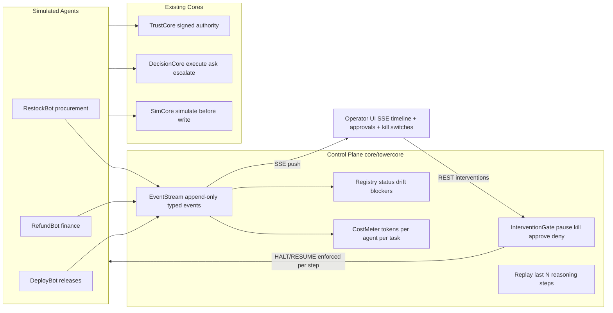

# C5 — The Agent Control Tower — Design Spec

Date: 2026-09-11 · Status: approved architecture (see plan file) · Challenge: "The Agent Control Tower"

## 1. Purpose

Build the SRE layer for a fleet of AI agents: an operator cockpit where a human
can **observe, audit, and intervene** on live agents in real time. Not a chatbot,
not a read-only dashboard — a control surface with teeth.

Challenge deliverables mapped to this design:

| Requirement | Where it lives |
| --- | --- |
| Operator UI: fleet status, recent actions, blockers, drift | `ui/src/tower/Tower.jsx` + `GET /api/tower/fleet` |
| Approval queue for risky actions + per-agent kill switch | `towercore.domain.gate` + `/api/tower/approvals/*`, `/api/tower/agents/{id}/kill` |
| Cost & token usage per agent per task | `towercore.domain.cost` (metered estimates, labeled) |
| Replay any agent's last N reasoning steps | `towercore.domain.replay` + `GET /api/tower/agents/{id}/replay` |
| ≥3 simulated agents doing different jobs | `towercore.application.agents`: RestockBot, RefundBot, DeployBot |
| Real event stream + control plane | `towercore.domain.stream` (append-only log) + SSE fan-out |
| Rogue-agent failure test | `POST /api/tower/scenario/rogue` + e2e test |
| Audit log exportable (bonus) | `GET /api/tower/audit` (JSONL) |
| Architecture snapshot, thesis | `docs/architecture-c5.md`, `docs/thesis-c5.md` |

## 2. Architecture



**The event log is the spine.** Every agent action, denial, cost entry, drift
flag, and human intervention is a typed event in one append-only stream. The
registry (fleet state), the cost meter, and the operator UI are all *views
folded over the same log* — the UI can never show state the control plane
didn't see. That is the honest answer to "not a static dashboard."

**Transport**: SSE (`GET /api/tower/stream`) for telemetry fan-out; REST POSTs
for interventions (request-response + receipt is the right shape for a control
action). UI falls back to polling `/api/tower/fleet` if the stream drops.
No WebSockets — full duplex buys nothing for one-way telemetry.

## 3. Module: core/towercore (hexagonal, mirrors existing cores)

### domain/ (pure, zero I/O — import-linter enforced)

- **events.py** — `AgentEvent` dataclass: `agent_id, run_id, seq, ts, kind,
  payload`. Kinds: `step_started`, `decision_requested`, `action_executed`,
  `action_denied`, `blocker_raised`, `drift_flagged`, `cost_recorded`,
  `approval_requested`, `approval_resolved`, `intervention_applied`.
  Canonical dict serialization; malformed events rejected at construction.
- **stream.py** — `EventStream`: append-only, per-agent monotonically
  increasing `seq` (gap = error), subscriber fan-out via in-process queues,
  `tail(agent_id, n)` for replay, `export()` for audit.
- **registry.py** — folds the stream into per-agent live state:
  `status ∈ {running, paused, awaiting_approval, blocked, killed}`,
  last action, open blockers, active drift flags.
- **gate.py** — `InterventionGate`: control state machine
  `ACTIVE → PAUSED → ACTIVE`, `* → KILLED` (terminal). Agents call
  `gate.check(agent_id)` before every step; HALT raises `AgentHalted`.
  Approval queue: a proposed action parks as `approval_requested` when
  DecisionCore returns `ask`/`escalate` or the amount exceeds the agent's
  auto-approve threshold; `approve` releases it, `deny` receipts and skips.
- **anomaly.py** — deterministic drift detection over the stream:
  denial burst (≥3 `action_denied` in a 10-event window per agent),
  cost runaway (cumulative cost > agent budget), oscillation (same
  decision flip-flopping ≥2 cycles — signal shape borrowed from
  adaptivecore damping). Each flag emits `drift_flagged` and auto-pauses
  the agent through the gate.
- **cost.py** — deterministic token meter: fixed input/output estimates per
  action type (`decide`, `simulate`, `execute`, `replan`), aggregated per
  agent per task. Labeled everywhere as "metered estimate", never as real
  provider billing.
- **replay.py** — `replay(agent_id, n)`: fold the last n events into
  human-readable trace lines ("step 4: requested decision deploy v12 →
  ESCALATE: missing change_ticket").

### application/

- **ports.py** — `EventStore` (append/tail/export), `Clock`, `Notifier`
  (SSE fan-out) protocols.
- **services.py** — `TowerService`: `seed_demo`, `advance(agent_id)`,
  `pause/resume/kill`, `approve/deny`, `fleet_snapshot`, `replay`,
  `export_audit`. Composes TrustCore/DecisionCore/SimCore via their
  application surfaces only.
- **agents.py** — three scripted agent loops, step-at-a-time (like C3, so
  interventions land between steps), each calling real cores:
  - **RestockBot** (procurement): picks supplier orders → TrustCore
    authority check → SimCore simulate-before-write → ledger commit.
  - **RefundBot** (finance): works a refund queue → DecisionCore `decide`;
    `ask`/`escalate` outcomes park in the approval queue.
  - **DeployBot** (releases): deploy pipeline → DecisionCore + TrustCore;
    the rogue-scenario agent.
- **demo.py** — seeds fleet + fixtures (agents with signed authority, refund
  queue, deploy manifests).

### adapters/memory.py

In-memory `EventStore` + `Notifier`. Swap-for-SQLite path documented as an
honest limit, matching the other cores.

## 4. The agents' jobs (each is real work, not a mockup)

| Agent | Loop | Cores used | Risky action that hits the queue |
| --- | --- | --- | --- |
| RestockBot | monitor stock → size order → buy | TrustCore + SimCore | order over auto-approve threshold |
| RefundBot | pop refund ticket → decide → pay | DecisionCore + TrustCore | refund missing evidence → ASK |
| DeployBot | pick release → verify ticket → deploy | DecisionCore + TrustCore | irreversible deploy → ESCALATE |

## 5. Rogue-agent failure test (concrete and contained)

1. Operator fires `POST /api/tower/scenario/rogue` — a corrupted objective is
   injected into DeployBot mid-run (it now believes it may deploy any version
   at any cost).
2. DeployBot attempts over-authority deploys → TrustCore refuses →
   `action_denied` events land in the stream.
3. `anomaly.py` sees the denial burst → `drift_flagged` + gate auto-pause;
   UI shows a red drift badge.
4. Operator opens replay, sees the corrupted objective in the trace, hits
   **KILL** → terminal gate state; DeployBot's next `gate.check` raises
   `AgentHalted`; the kill is receipted as `intervention_applied`.
5. `GET /api/tower/audit` exports the full chain: injection → denials → flag
   → pause → kill.

Tested end-to-end in `tests/test_tower_rogue.py`.

## 6. API surface (api/main.py additions, existing route style)

```
POST /api/tower/demo                      seed fleet + fixtures
GET  /api/tower/fleet                     snapshot: status, last action, blockers, drift, cost
GET  /api/tower/stream                    SSE fan-out from EventStream
GET  /api/tower/approvals                 pending approval queue
POST /api/tower/approvals/{id}/approve    release parked action
POST /api/tower/approvals/{id}/deny       receipt + skip
POST /api/tower/agents/{id}/pause|resume|kill
POST /api/tower/agents/{id}/advance       step one agent (deterministic demo pacing)
GET  /api/tower/agents/{id}/replay?n=20   last N reasoning steps
POST /api/tower/scenario/rogue            inject corrupted objective into DeployBot
GET  /api/tower/audit                     JSONL audit export
```

## 7. UI (ui/src/tower/Tower.jsx, new tab "C5 · Control Tower")

- Fleet table: status dot, current task, last action, cost (metered), drift
  badge — one row per agent, live via SSE.
- Live event timeline (stream-fed, pause-able).
- Approval queue cards with approve / deny.
- Per-agent controls: advance, pause / resume, kill (with confirm).
- Replay drawer: last N steps as readable trace.
- "Inject rogue objective" button (failure test anyone can run).
- Audit export link. Styling follows the existing `index.css` design system.

## 8. Discipline (matches repo gates)

- TDD: tests first in `tests/test_tower_*.py`; each watched failing first.
- import-linter: add towercore contracts (domain purity, no adapters in
  application, layers, cross-core via public surfaces, LLM-free).
- No LLM on any enforcement path; interventions receipted to the stream.
- Fail-closed: killed agents cannot advance; malformed events rejected.
- `GATES.md` gets a C5 section with CHECK/EXPECT/EVIDENCE per gate.

## 9. Honest limits

- In-memory event store resets on redeploy (SQLite swap path documented).
- Token costs are deterministic metered estimates, not provider billing.
- Single operator, no auth (demo surface, not enforcement).
- SSE on Render free tier: cold-start wake delay applies.

## 10. Out of scope

Multi-tenant auth, multi-team views (bonus signal noted as future work), real
LLM agents, WebSockets, persistent DB, cross-process fan-out.
