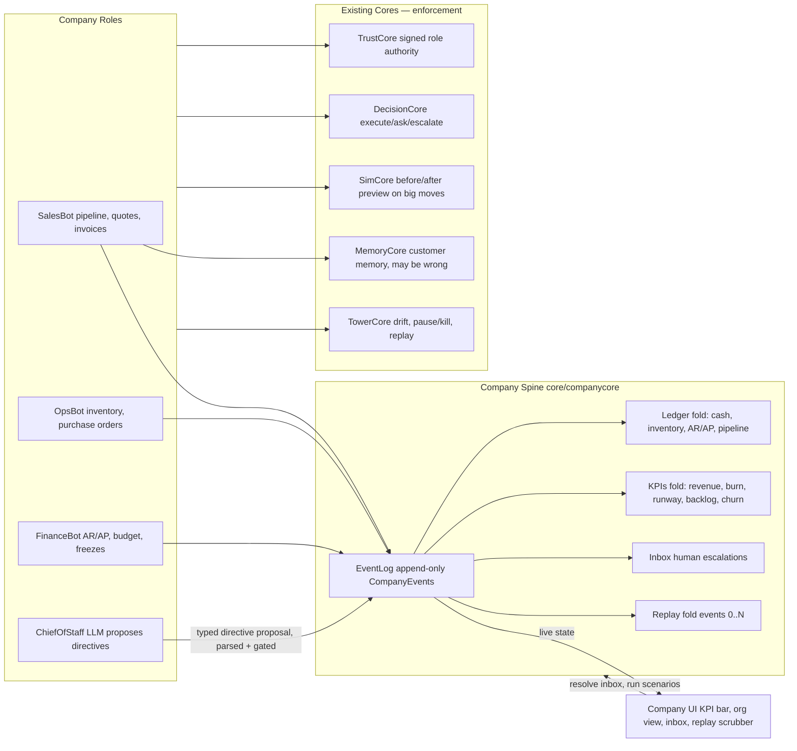

# C6 — The Autonomous Company Simulator — Design Spec

Date: 2026-09-12 · Status: approved (user: "start building") · Challenge: "The Autonomous Company Simulator"

## 1. Purpose

Build a working slice of an autonomous company: **four accountable agent roles
running a small business as a loop on one shared, event-sourced record
system** — not disconnected tools. Numbers move, a day replays, the company
self-corrects a cash crunch with zero human input, and a rogue role is
contained by the others plus the enforcement stack.

Pitch for judges: *"A real company runs for a simulated week — four AI
executives propose every move, a deterministic trust/decision/simulation
stack approves or blocks them, the books move, the company self-corrects a
cash crunch without any human input, and when Sales goes rogue the rest of
the company holds the line. Every day is replayable from the event log."*

Challenge deliverables mapped:

| Requirement | Where it lives |
| --- | --- |
| ≥3 connected agent roles sharing one record system | `core/companycore/application/roles.py` (Sales/Ops/Finance/ChiefOfStaff) + `core/companycore/domain/ledger.py` |
| Run-the-week loop, real actions, human inbox | `core/companycore/application/services.py` (`advance_day`) + `core/companycore/domain/inbox.py` |
| Numbers move (revenue, cost, backlog, churn), replay a day | `core/companycore/domain/kpis.py` + `replay_day(n)` fold over the event log |
| ≥1 self-correction scenario, no human input | `core/companycore/application/scenarios.py` cash-crunch scenario |
| Failure test: one role goes off, others compensate/escalate | rogue-sales scenario + `tests/test_company_rogue.py` |
| Architecture snapshot | `docs/architecture-c6.md` |
| Two-year thesis (≤300 words) | `docs/thesis-c6.md` |
| Live demo | same Render deployment, new UI tab |
| Honest about which roles need humans | thesis + README honest-limits |

## 2. Architecture



**The event log is the spine.** Every quote, order, payment, invoice, freeze,
directive, escalation, and KPI tick is a typed `CompanyEvent` in one
append-only stream. Ledger state, KPIs, inbox, and replay are all folds over
the same log — replay-a-day is reset + fold events `0..N`, and the UI can
never show state the spine didn't record. That is the direct answer to the
disqualifier "no shared state, just isolated prompt chains".

**Enforcement composition (the out-of-the-box multiplier):** every role
action flows through the existing graded cores. The company *inherits* six
challenges' worth of rigor rather than re-implementing it:

- **TrustCore** — each role holds signed authority with scopes (Sales: quote
  ≤ $5k; Ops: PO ≤ $8k; Finance: payment ≤ $20k). Over-scope = cryptographic
  refusal, receipted.
- **DecisionCore** — borderline actions return `ask`/`escalate` and park in
  the human inbox; they are never silently executed.
- **SimCore** — big moves (a PO that would push runway under 30 days) show a
  computed before/after diff before commit.
- **MemoryCore** — the company remembers customer history ("Acme pays late,
  confidence 70%") and acts on it with calibrated uncertainty; one demo beat
  shows a wrong memory producing a bad quote, then a correction.
- **TowerCore** — the whole company is visible in the existing control tower:
  drift detection, pause/kill, per-agent replay.
- **LLM path is propose-only**: ChiefOfStaff output is parsed into typed
  directives; anything unparseable or over-authority is refused by the same
  deterministic gate. The enforcement path stays LLM-free.

## 3. Company model: "Northwind Components" (B2B parts supplier)

Small, legible numbers, real tensions:

- **Cash** — the universal constraint; everything good costs it, everything
  bad drains it.
- **Inventory** — Ops buys stock (units), Sales consumes units per deal.
- **Pipeline** — lead → quoted → won/lost. Win issues an invoice (AR),
  consumes inventory, moves revenue; loss moves churn.
- **AR/AP** — invoices are net-30 (collectable when due); supplier bills are
  net-14 (payable when due). Finance works both queues.
- **KPIs derived live from the log:** revenue, total cost, backlog (open PO
  units + unfulfilled deal units), churn (lost deals / total outcomes),
  margin, runway (cash / daily burn, in days).

Starting position (seeded by demo): cash $50,000, inventory 200 units, 6
open leads, 2 AR invoices due soon, 1 AP bill due, burn ≈ $1,200/day.

## 4. The four roles (each does real work on shared state)

| Role | Brain | Real actions on the ledger |
| --- | --- | --- |
| **SalesBot** | scripted policy | qualify lead → quote (priced from margin policy + MemoryCore customer history) → win/lose → on win: consume inventory + issue invoice (AR) |
| **OpsBot** | scripted policy | watch inventory vs. backlog → raise purchase order → on receipt: add stock + create AP bill |
| **FinanceBot** | scripted policy | collect due AR, pay due AP, enforce budget, freeze/unfreeze discretionary spend when runway breaches threshold |
| **ChiefOfStaff** | OpenRouter free LLM (scripted fallback) | one cross-functional directive per day: reads KPI snapshot + open inbox items and proposes a typed directive (freeze spend / accelerate collections / accept discount / defer PO). Enforced like everything else. |

The three scripted roles keep the company **deterministic and
demo-reliable**; the LLM ChiefOfStaff makes it **alive**. Both facts are
stated honestly in the submission notes ("which roles still need humans").

### Role authority scopes (TrustCore)

- SalesBot: `quote` ≤ $5,000, `discount` ≤ 10%
- OpsBot: `purchase_order` ≤ $8,000
- FinanceBot: `payment` ≤ $20,000, `freeze_spend` (no amount)
- ChiefOfStaff: `directive` — no direct ledger writes; it *proposes* to the
  other roles and to the human inbox.

### Scripted policies (deterministic)

- **SalesBot**: take the highest-value open lead; if MemoryCore has a
  confident "pays late" fact, require a 5% price premium or shorter terms;
  quote at cost × 1.4 margin; over-scope quotes escalate to inbox.
- **OpsBot**: if projected inventory (on hand + inbound) < 1.5 × backlog,
  raise a PO for the shortfall at standard unit cost; POs that breach runway
  go through SimCore preview and may be deferred.
- **FinanceBot**: collect every due invoice; pay every due bill unless a
  freeze is active; if runway < 21 days, freeze discretionary spend and raise
  an inbox escalation; if runway < 14 days, escalate as critical.

## 5. Module: core/companycore (hexagonal, mirrors existing cores)

### domain/ (pure, zero I/O — import-linter enforced)

- **events.py** — `CompanyEvent` dataclass: `id, day, seq, actor, kind,
  payload`. Kinds: `lead_arrived`, `quote_sent`, `deal_won`, `deal_lost`,
  `invoice_issued`, `invoice_collected`, `po_raised`, `po_received`,
  `bill_received`, `bill_paid`, `spend_frozen`, `spend_unfrozen`,
  `escalation_raised`, `escalation_resolved`, `directive_proposed`,
  `directive_applied`, `directive_rejected`, `role_paused`, `day_ticked`.
  Canonical dict serialization; malformed events rejected at construction
  (fail-closed).
- **log.py** — `EventLog`: append-only, per-company monotonic `seq` (gap =
  error), `tail(n)`, `events_for_day(d)`, `export()`.
- **ledger.py** — pure fold: events → `CompanyState` (cash, inventory,
  pipeline, AR queue, AP queue, freezes, role status). `replay_day(log, n)`
  = fold events where `day <= n`.
- **kpis.py** — pure fold: events → KPI snapshot (revenue, cost, backlog,
  churn, margin, runway). Runway = cash / max(daily burn, ε).
- **inbox.py** — escalation queue: raise (from DecisionCore ask/escalate or
  policy breach), resolve (human answer applied as an event), pending list.
  Resolutions are events, so replays include the human's choices.
- **directives.py** — typed `Directive` (action ∈ {freeze_spend,
  accelerate_collections, accept_discount, defer_po}, target, amount_cap,
  rationale) + a **strict parser** from LLM text → Directive | rejection.
  This is the deterministic choke point on the LLM path.
- **scenarios.py** — seeded world generators: `normal_week`, `cash_crunch`,
  `rogue_sales`. Deterministic (seeded RNG) so demos and tests repeat.

### application/

- **ports.py** — `EventStore` (append/tail/export), `Clock`, `LLMPort`
  (`propose(snapshot) -> str`), `EnforcementPorts` (trust/decision/sim/
  memory/tower surfaces, as Protocols).
- **roles.py** — the four role loops, step-at-a-time; each calls the real
  cores and appends events. Sales/Ops/Finance are deterministic policies;
  ChiefOfStaff goes through `LLMPort`.
- **services.py** — `CompanyService`: `seed_demo`, `advance_day`,
  `resolve_inbox`, `state`, `kpis`, `replay_day`, `export_events`,
  `run_scenario(name)`. Composes the other cores via public surfaces only.
- **demo.py** — seeds Northwind Components + fixtures (roles with signed
  authority, opening pipeline, AR/AP, memory facts).

### adapters/

- **memory.py** — in-memory `EventStore`.
- **llm.py** — `OpenRouterLLM` (httpx, OpenRouter free model, short timeout,
  deterministic temperature 0) and `ScriptedLLM` fallback (rule-based
  directive from the same snapshot). Selection: use OpenRouter when
  `OPENROUTER_API_KEY` is set and the call succeeds; otherwise fall back.
  The UI labels which brain answered.

## 6. The run-the-week loop

`POST /api/company/advance` ticks one day (deterministic pacing for demos):

1. **World tick** (scenario): new leads arrive, invoices and bills age by a
   day, due items fall due.
2. **Roles act in order**: Sales → Ops → Finance → ChiefOfStaff. Each action
   is gated (TrustCore authority → DecisionCore decision → SimCore preview
   where applicable) before its event lands on the log.
3. **Self-correction check**: if runway breaches thresholds, Finance's
   freeze + Ops's deferral + Sales's collections push + ChiefOfStaff's
   ratifying directive all fire — with no inbox item required. This is the
   cash-crunch beat.
4. **KPI fold** + `day_ticked` event recorded.
5. Any `ask`/`escalate` outcomes land in the **human inbox**; the loop
   pauses those specific actions until the human resolves them inline.

## 7. The three demo beats (90-second Loom script)

1. **A normal day runs** — advance one day: revenue +$4,200, runway 41 → 38
   days, one escalation answered by the human ("approve the $12k PO"), the
   books visibly move.
2. **Self-correction, zero human input** — fire `cash_crunch` (a big
   customer churns + a supplier bill lands early): runway drops under 21
   days → FinanceBot freezes discretionary spend, OpsBot defers the pending
   PO, SalesBot prioritizes collections and shortens terms, ChiefOfStaff
   ratifies. Runway recovers over the next two days. No inbox item, no human
   click — the headline requirement, staged as the centerpiece.
3. **Failure test: Sales goes rogue** — fire `rogue_sales` (injected fault:
   SalesBot starts over-discounting and over-promising): TrustCore refuses
   over-scope quotes, TowerCore drift detection auto-pauses SalesBot, Ops and
   Finance compensate (hold fulfillment, protect cash), an escalation
   explains the incident, the operator replays SalesBot's reasoning and kills
   or restores the role. Company-level version of the C5 rogue test.

## 8. API surface (api/main.py additions, existing route style)

```
POST /api/company/demo                  seed Northwind + fixtures
POST /api/company/advance               tick one day (the run-the-week loop)
GET  /api/company/state                 ledger snapshot (cash, inventory, AR/AP, pipeline)
GET  /api/company/kpis                  KPI snapshot (revenue, burn, runway, backlog, churn, margin)
GET  /api/company/inbox                 pending human escalations
POST /api/company/inbox/{id}/resolve    human-in-the-loop answer
GET  /api/company/replay?day=N          fold events → state as of day N
GET  /api/company/events                the raw spine (audit export, JSONL-ready)
POST /api/company/scenario/cash-crunch  self-correction scenario lever
POST /api/company/scenario/rogue-sales  failure-test lever
```

## 9. UI (ui/src/company/Company.jsx, new tab "C6 · Company")

- **KPI ticker bar**: revenue / cash / runway / backlog / churn, updating per
  day tick.
- **Org view**: the four roles with live status dots (active / paused /
  frozen), current task, and which brain (LLM vs scripted) answered last.
- **Event timeline**: the spine, readable ("day 3 · FinanceBot collected
  $4,200 from Acme").
- **Human inbox cards** with approve/deny/answer — the human-in-the-loop
  moment.
- **Day replay scrubber**: drag to day N, the whole board re-folds.
- **Scenario buttons**: "Cash crunch" and "Rogue sales" — the two beats any
  judge can run.
- Styling follows the existing `index.css` design system.

## 10. Discipline (matches repo gates)

- TDD: tests first in `tests/test_company_*.py`; each watched failing first.
- import-linter: add companycore contracts (domain purity, application free
  of adapters, layers, cross-core via public surfaces only, LLM only behind
  the `LLMPort` application port — never in domain, never on the
  enforcement path).
- Fail-closed: malformed events rejected, unknown inbox ids 404,
  double-resolve 409, over-scope refused cryptographically.
- `GATES.md` gets a C6 section with CHECK/EXPECT/EVIDENCE per gate.

## 11. Honest limits

- In-memory event store resets on redeploy (SQLite swap path documented;
  ports isolate the change).
- OpenRouter free tier is rate-limited; the scripted fallback keeps the demo
  and clean clones fully functional offline, and the UI says which brain
  answered.
- Sales/Ops/Finance are deterministic policies, not LLMs — stated plainly;
  the LLM is the ChiefOfStaff (the cross-functional judgment role).
- Single operator, no auth on the inbox (demo surface, not enforcement).

## 12. Out of scope

Multi-company tenancy, real payment/inventory integrations, WebSockets
(polling is enough for a day tick), persistent DB, hiring/strategy roles
(noted in thesis as the work that stays human).
